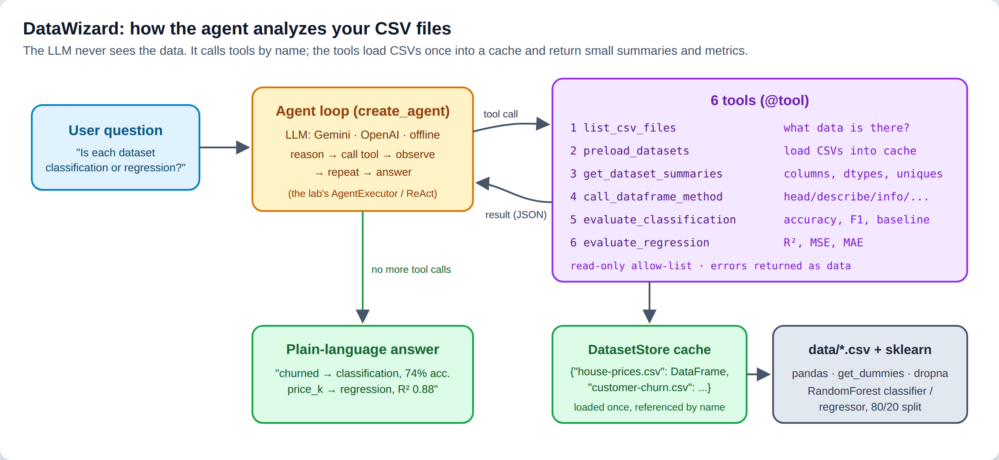
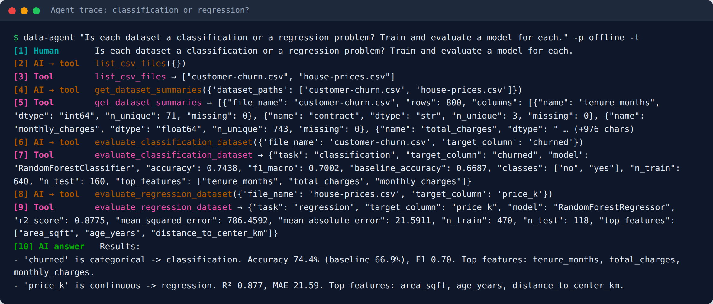
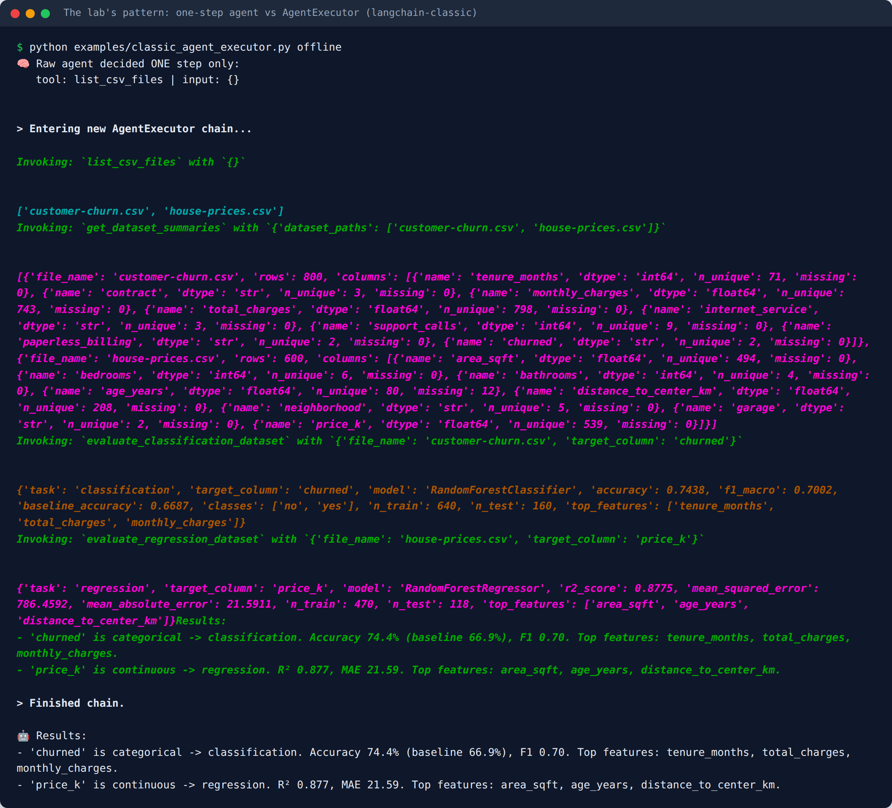
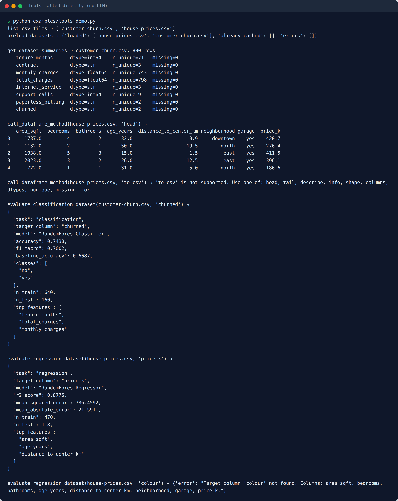
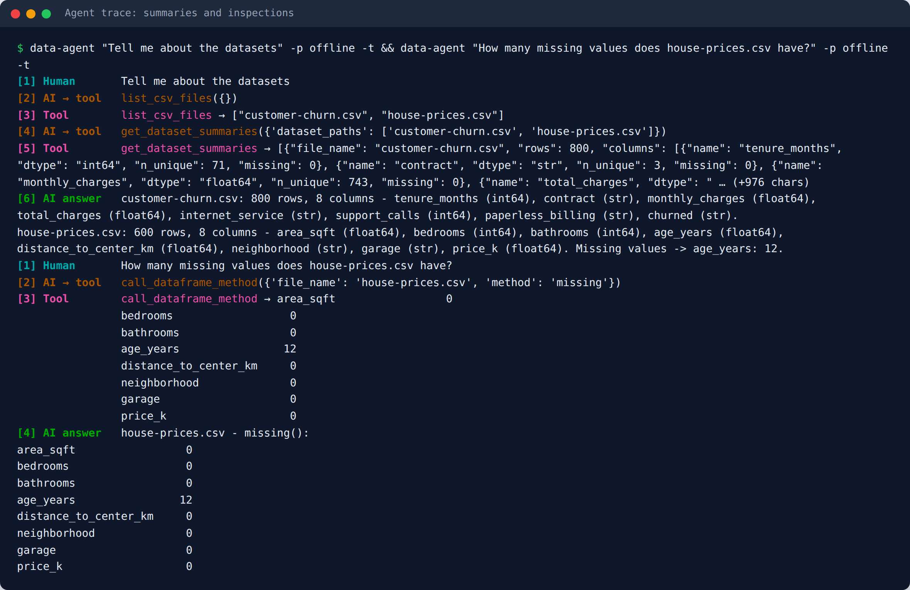
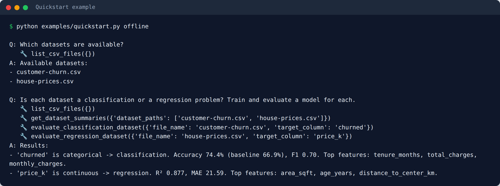
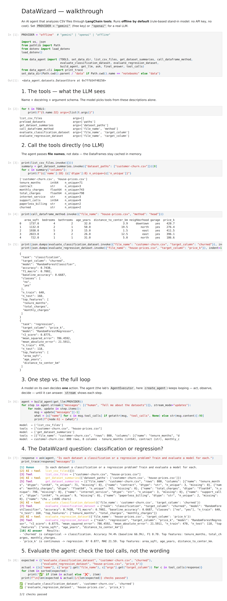
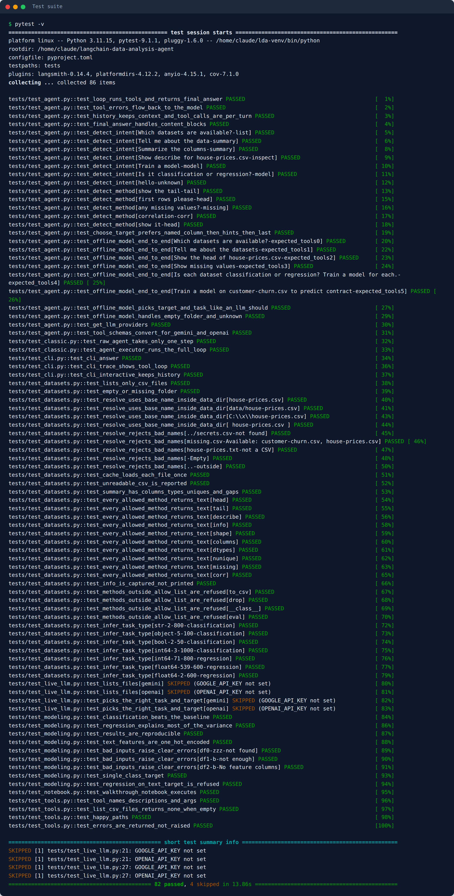
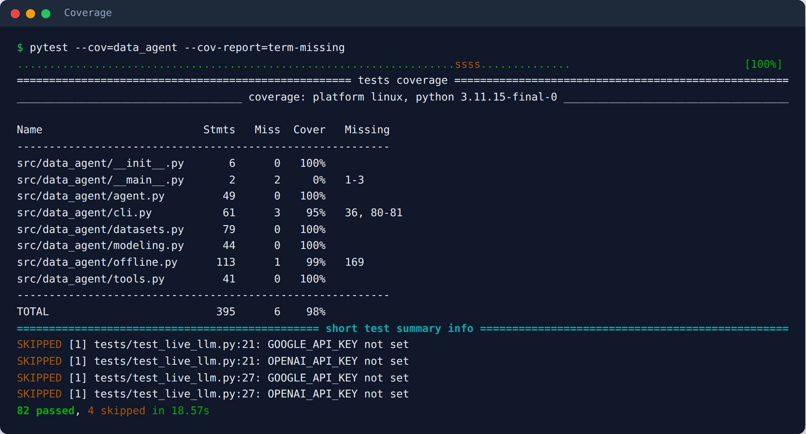

# DataWizard — AI Data Analysis Agent with LangChain

[](https://github.com/<your-user>/langchain-data-analysis-agent/actions/workflows/tests.yml)


Ask questions about CSV files in plain English: *"Which datasets do I have?"*, *"Any missing values?"*, *"Is this a classification or a regression problem? Train a model."* An AI agent answers by **calling data-science tools** (pandas + scikit-learn) instead of guessing. Built with LangChain 1.x `@tool` and `create_agent`. It works with **Google Gemini** (free API tier), **OpenAI**, or a built-in **offline mode** that needs no key and costs nothing.

> Portfolio version of the lab *"DataWizard: AI-Powered Data Analysis"* from IBM's **Fundamentals of Building AI Agents** course (Coursera), re-implemented as a tested, installable package. See [Credits](#credits).



---

## Contents

- [What the lab asks you to do](#what-the-lab-asks-you-to-do)
- [Features](#features)
- [Quick start (free)](#quick-start-free)
- [How it works](#how-it-works)
- [Usage](#usage) — CLI · Python API · notebook
- [Testing](#testing)
- [Project structure](#project-structure)
- [Configuration](#configuration)
- [Lessons learned](#lessons-learned)
- [Credits](#credits)

## What the lab asks you to do

**The problem:** business users have valuable data in spreadsheets but can't write pandas or scikit-learn. **The goal:** a chat assistant that does the data-science steps for them.

You don't write a script that analyzes one file. You build **tools** — small, well-documented Python functions — and give them to an LLM. The LLM then decides which tool to call, in which order, for whatever the user asks.

| Lab step | What you build | Where it lives here |
|---|---|---|
| 1. Discover data | `list_csv_files` tool: which CSVs exist? | [`tools.py`](src/data_agent/tools.py), [`datasets.py`](src/data_agent/datasets.py) |
| 2. Cache datasets | a shared in-memory cache, so the agent passes **file names, not data** (saves tokens) | `DatasetStore` in `datasets.py` |
| 3. Summarize | `get_dataset_summaries`: columns and data types | `tools.py` |
| 4. Explore | `call_dataframe_method`: `head`, `describe`, `info`, … | `tools.py` |
| 5. Model | `evaluate_classification_dataset` / `evaluate_regression_dataset`: train a RandomForest, return metrics | [`modeling.py`](src/data_agent/modeling.py) |
| 6. Agent | prompt + LLM + tools; see that a bare agent does **one step only** | [`examples/classic_agent_executor.py`](examples/classic_agent_executor.py) |
| 7. Executor | `AgentExecutor` runs the full **ReAct loop** (reason → act → observe → repeat) | `create_agent` in [`agent.py`](src/data_agent/agent.py) |
| 8. Chat | a `while True: input()` loop: the DataWizard bot | [`cli.py`](src/data_agent/cli.py) (`data-agent`) |

**The key test question** from the lab: *"Is each dataset for classification or regression?"* A good agent lists the files, reads their structure, spots the target column and its type (text or few values → classification; continuous numbers → regression), then calls the matching evaluation tool:



The lab uses LangChain 0.3's `create_openai_tools_agent` + `AgentExecutor`. This repo uses the LangChain 1.x successor, `create_agent`, and keeps the lab's original pattern runnable through `langchain-classic`:



## Features

| | |
|---|---|
| 🧰 **6 tools** | list, preload, summarize, inspect, evaluate classification, evaluate regression |
| 🗃️ **Dataset cache** | each CSV is read once; the LLM only ever handles names, summaries and metrics |
| 🧠 **Task detection** | summaries include dtype + unique counts, so the model can tell classification from regression |
| 📈 **Honest metrics** | accuracy **with a majority-class baseline**, F1; R², MSE, MAE; top features; fixed seed |
| 🔒 **Safe by design** | read-only allow-list of DataFrame methods; file access limited to the data folder |
| ⚠️ **Errors as data** | unknown file/column, unreadable CSV, single-class target → a message the agent can explain |
| 🔌 **3 providers** | `gemini` (free tier) · `openai` · `offline` (no key, no cost) |
| 💬 **CLI chat** | `data-agent`, with `--trace` to watch every tool call; remembers the conversation |
| ✅ **82 tests, 98% coverage** | all offline in CI; live LLM evaluation is opt-in |

## Quick start (free)

```bash
git clone https://github.com/<your-user>/langchain-data-analysis-agent.git
cd langchain-data-analysis-agent
python -m venv .venv && source .venv/bin/activate        # Windows: .venv\Scripts\activate
pip install -e ".[gemini,dev]"

# 1) No key, no cost - offline mode
data-agent "Is each dataset a classification or a regression problem? Train a model for each." -p offline --trace

# 2) Real LLM, still free: get a key at https://aistudio.google.com -> "Get API key"
cp .env.example .env          # paste GOOGLE_API_KEY=... (Windows: copy .env.example .env)
data-agent                    # interactive DataWizard chat, type 'exit' to quit
```

> **Cost:** offline mode and the tests never call an API. Gemini's free tier has rate limits (a busy question can hit a 429; just retry), and Google may use free-tier prompts to improve its models, so keep private data out. OpenAI is billed per token.

## How it works

### 1. Tools are functions with a contract

A tool is a plain function wrapped with `@tool`. Its **name, docstring and type hints** become the schema the LLM reads, so the docstring is effectively part of the prompt:

```python
@tool
def evaluate_regression_dataset(file_name: str, target_column: str) -> dict[str, Any]:
    """Train and evaluate a RandomForest regressor to predict a continuous numeric column.

    Use when the target is a number with many distinct values (e.g. price, sales).
    Returns {"r2_score", "mean_squared_error", "mean_absolute_error", ...} or {"error": "..."}.
    """
    try:
        return evaluate_regression(STORE.load(file_name), target_column)
    except (DatasetError, ModelingError) as exc:
        return {"error": str(exc)}
```

Every tool can be tested directly, with no LLM:



### 2. The cache: names in, metadata out

Sending a whole CSV to the model would waste tokens and context. Instead, `DatasetStore` loads each file once and keeps it in memory. Tools exchange **file names**, and return only **summaries and metrics**:

```python
STORE.summary("house-prices.csv")
# {"file_name": "house-prices.csv", "rows": 600,
#  "columns": [{"name": "price_k", "dtype": "float64", "n_unique": 539, "missing": 0}, ...]}
```

### 3. The agent loop

```python
from data_agent import build_agent, get_llm, ask, final_answer

agent = build_agent(get_llm("gemini"))      # or "openai" / "offline"
response = ask(agent, "Tell me about the datasets")
print(final_answer(response))
```

`create_agent` repeats **model → tool → model** until the model stops asking for tools, which is what the lab's `AgentExecutor` did:



| Message | Meaning |
|---|---|
| `Human` | the question |
| `AI → tool` | the model chose a tool and its arguments (`AIMessage.tool_calls`) |
| `Tool` | the real result (`ToolMessage`), appended to the history |
| `AI answer` | no more tool calls → final plain-language answer |

## Usage

### CLI

```bash
data-agent "Which datasets are available?"
data-agent "Show describe for house-prices.csv" --trace
data-agent "Train a model on customer-churn.csv to predict contract" -p openai
data-agent --data-dir path/to/my/csvs          # analyze your own files
python -m data_agent --help
```

### Python API

```python
from data_agent import build_agent, get_llm, ask, tool_calls, set_data_dir

set_data_dir("data")
agent = build_agent(get_llm("offline"))
response = ask(agent, "Train and evaluate a model for each dataset")
[(c["name"], c["args"]) for c in tool_calls(response)]
# [('list_csv_files', {}), ('get_dataset_summaries', {...}),
#  ('evaluate_classification_dataset', {'file_name': 'customer-churn.csv', 'target_column': 'churned'}),
#  ('evaluate_regression_dataset', {'file_name': 'house-prices.csv', 'target_column': 'price_k'})]

followup = ask(agent, "Which model did better?", history=response["messages"])   # keeps context
```



### Notebook

[`notebooks/walkthrough.ipynb`](notebooks/walkthrough.ipynb) goes through tools → cache → one step vs. the loop → the classification/regression question → evaluating the agent. It runs offline by default.

<details>
<summary>Screenshot of the executed notebook</summary>



</details>

### Sample data

`data/` contains two **synthetic** datasets, generated by `scripts/make_datasets.py`:

| File | Rows | Target | Task |
|---|---|---|---|
| `customer-churn.csv` | 800 | `churned` (yes/no) | classification |
| `house-prices.csv` | 600 (12 with missing `age_years`) | `price_k` (thousands $) | regression |

To use the original lab's CSVs instead: `python examples/download_lab_datasets.py`, then `data-agent ... --data-dir data/lab`.

## Testing

```bash
pytest                                            # 82 offline tests, no API keys
pytest --cov=data_agent --cov-report=term-missing
pytest -m live -v                                 # real-LLM evaluation (GOOGLE_API_KEY / OPENAI_API_KEY)
```

| Test file | What it checks | LLM? |
|---|---|---|
| `test_datasets.py` | discovery, path safety (`../secrets.csv`), cache, summaries, method allow-list, task-type heuristic | no |
| `test_modeling.py` | models beat the baseline, reproducible, text features encoded, clear errors on bad input | no |
| `test_tools.py` | tool names/schemas the LLM sees; errors returned, not raised | no |
| `test_agent.py` | real `create_agent` loop with a scripted fake model: message order, error flow, history; offline model end to end; Gemini/OpenAI schema conversion | no |
| `test_classic.py` | the lab's pattern: one-step agent vs. `AgentExecutor` | no |
| `test_cli.py` | answers, `--trace`, interactive chat with memory | no |
| `test_notebook.py` | the walkthrough notebook runs top to bottom | no |
| `test_live_llm.py` | a real model picks the **right tool + target column** for each dataset | yes |

**Strategy:** everything that can be deterministic (tools, cache, modeling, orchestration) is tested offline in CI. Real-model behavior is a separate, opt-in **evaluation** that checks *which tool was called with which arguments*, never the wording, because the wording changes between runs.





CI runs the offline suite on Python 3.10–3.12. The live job runs on push only for providers whose key is stored as a repository secret.

## Project structure

```
langchain-data-analysis-agent/
├── src/data_agent/
│   ├── datasets.py     # DatasetStore: discovery, cache, summaries, allow-listed inspections
│   ├── modeling.py     # feature prep + RandomForest classification/regression metrics
│   ├── tools.py        # the 6 @tool wrappers the LLM calls
│   ├── agent.py        # get_llm() provider switch, build_agent(), response helpers
│   ├── offline.py      # rule-based stand-in model (no key, no cost)
│   └── cli.py          # `data-agent` chat with --trace
├── data/               # synthetic sample CSVs
├── tests/              # 82 offline tests + opt-in live evals
├── examples/           # quickstart, tools demo, classic AgentExecutor, lab-data download
├── notebooks/          # walkthrough.ipynb (executed)
├── scripts/            # make_datasets.py, build_notebook.py, make_screenshots.py
├── docs/images/        # README screenshots
└── .github/workflows/  # CI
```

## Configuration

Copy `.env.example` to `.env`:

| Variable | Default | Purpose |
|---|---|---|
| `LLM_PROVIDER` | `gemini` | `gemini` · `openai` · `offline` |
| `GOOGLE_API_KEY` / `GEMINI_MODEL` | – / `gemini-2.5-flash` | Gemini (free key from AI Studio) |
| `OPENAI_API_KEY` / `OPENAI_MODEL` | – / `gpt-4o-mini` | OpenAI |
| `DATA_DIR` | `data` | folder with the CSV files |

Extras: `pip install -e ".[gemini]"`, `".[openai]"`, `".[classic]"` (lab's `AgentExecutor`), `".[dev]"`, or `".[all]"`.

### About offline mode

`OfflineDataModel` is **not an LLM**. It's a small keyword-rule model that uses the same tool-calling protocol (emits `tool_calls`, reads `ToolMessage`s), so the real agent loop and real tools run without a key. It follows a fixed plan per intent (list / summarize / inspect / model) and picks target columns with the same heuristic an LLM is expected to use. It's useful for demos, CI and screenshots; for open-ended questions, use Gemini or OpenAI.

All screenshots are real output of the commands shown, generated in offline mode by `python scripts/make_screenshots.py`.

## Lessons learned

- **Tools, not scripts.** You don't hard-code an analysis. You give the LLM well-described capabilities, and it composes them per question.
- **Pass references, not data.** A cache plus file names keeps prompts small, and the model never needs the raw rows.
- **Docstrings and type hints are the interface.** The model chose `evaluate_classification_dataset` because its docstring says *"use when the target is text or has few distinct values"*.
- **An agent alone takes one step.** The loop (`AgentExecutor`, now `create_agent`) is what turns one tool call into a finished analysis.
- **Fix the lab's sharp edges:** the original notebook forgot the regression imports (`NameError`), reset the cache mid-notebook, returned `"None"` for `df.info()`, crashed on text columns, and let the LLM call *any* DataFrame method via `getattr`.
- **Metrics need context.** 74% accuracy only means something next to the 67% baseline of always guessing "no".
- **Test the agent on its decisions.** Assert the tool and the target column chosen, not the sentence it writes.

## Credits

- Concept and exercises: IBM Skills Network lab *DataWizard: AI-Powered Data Analysis* (J. Santarcangelo, K. Goswami, K. Makwana; contributor W. Elbouni), part of **Fundamentals of Building AI Agents** on Coursera. The original notebook is IBM-copyrighted and is **not** included; this repo is an independent re-implementation with its own synthetic data.
- Built with [LangChain](https://python.langchain.com/), [LangGraph](https://langchain-ai.github.io/langgraph/), [pandas](https://pandas.pydata.org/) and [scikit-learn](https://scikit-learn.org/).

## License

[MIT](LICENSE) © VictorV
